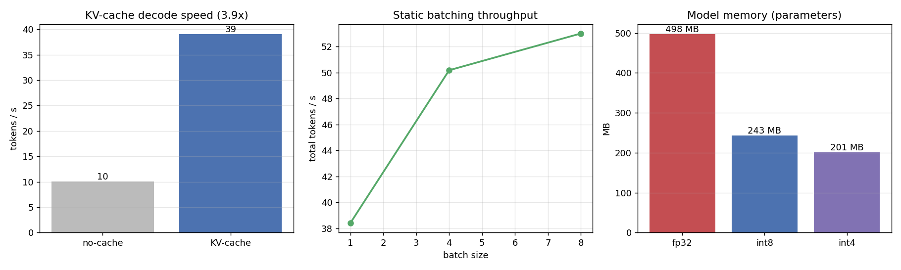
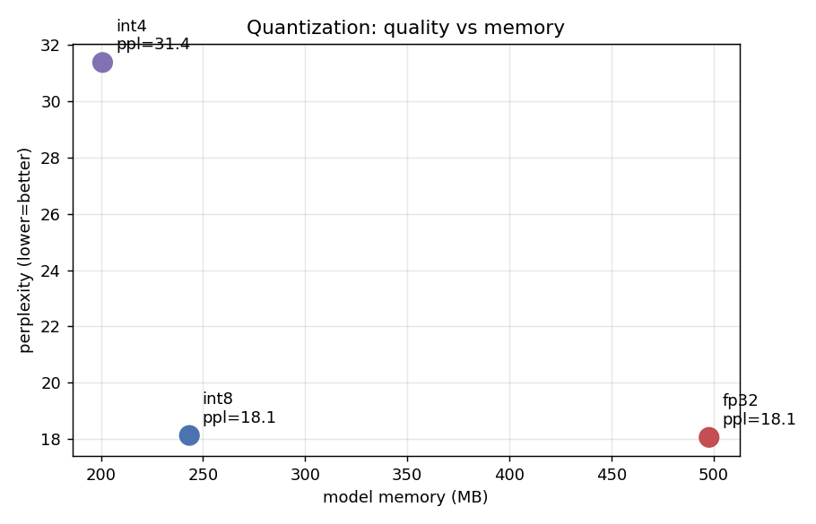

# nanollm — an optimized LLM inference engine

> **Languages:** **English** · [Português](README.pt-BR.md)

> A from-scratch inference engine that runs **real GPT-2** with the optimizations
> that production engines (TensorRT-LLM, vLLM, llama.cpp) are built on: **KV-cache**,
> **FlashAttention-style fused attention**, **INT8/INT4 weight quantization**, and
> **static batching** — in pure Python/NumPy, with the fused kernels written in
> **Triton** for the GPU. Efficient LLM inference is NVIDIA's core business today;
> this shows the machinery underneath.

```bash
python scripts/download_model.py                       # fetch GPT-2 (124M)
python scripts/generate.py "The future of AI is" --max-new 40
```
```
The future of AI is uncertain. The future of AI is uncertain. The future of AI is
uncertain. ...                       # real GPT-2 124M, generated by this engine
```

---

## Results (real, measured on CPU in this repo)

GPT-2 124M, `scripts/benchmark.py` + `scripts/eval_perplexity.py`:

| Optimization | Metric | Result |
|---|---|---|
| **KV-cache** | decode throughput | **10.0 → 39.1 tok/s (3.9× faster)** |
| KV-cache | latency split | TTFT 58 ms · per-token 24 ms |
| **Static batching** | total throughput | 38 → 50 → **53 tok/s** (batch 1→4→8) |
| **INT8 quant** | perplexity / memory | **18.06 → 18.13** (+0.4%) · 498 → **243 MB** |
| INT4 quant | perplexity / memory | 18.06 → 31.38 · 498 → 201 MB |




> The headline: **INT8 halves the model with essentially no quality loss**, and
> the **KV-cache gives a 3.9× decode speedup** — the two optimizations that matter
> most for serving. Numbers are from this machine's CPU; the **Triton GPU kernels**
> are written and validated algorithmically but run on real hardware (this dev box
> has no GPU — see *Honesty note*).

---

## What's implemented

| Feature | Where | Status |
|---|---|---|
| Load real open-source weights (GPT-2, safetensors) | [`loader.py`](nanollm/loader.py) | ✅ runs |
| GPT-2 BPE tokenizer from scratch | [`tokenizer.py`](nanollm/tokenizer.py) | ✅ matches canonical ids |
| GPT-2 forward (NumPy), generates coherent text | [`model.py`](nanollm/model.py) | ✅ runs |
| **KV-cache** autoregressive decode | [`model.py`](nanollm/model.py) | ✅ 3.9× |
| **FlashAttention-style** fused attention | [`attention.py`](nanollm/attention.py) (NumPy) · [`triton_kernels.py`](nanollm/triton_kernels.py) (GPU) | ✅ NumPy validated · 🟡 Triton = GPU |
| **INT8/INT4** weight quantization | [`quant.py`](nanollm/quant.py) | ✅ runs |
| **Fused dequant-matmul** kernel | [`triton_kernels.py`](nanollm/triton_kernels.py) | 🟡 GPU |
| **Static batching** (left-pad + mask) | [`generate.py`](nanollm/generate.py) | ✅ runs |
| Sampling (greedy / temperature / top-k) | [`generate.py`](nanollm/generate.py) | ✅ runs |
| Metrics: tok/s, latency, memory, perplexity | [`metrics.py`](nanollm/metrics.py), `scripts/` | ✅ runs |

The deep dive on *why* each optimization works is in
**[docs/OPTIMIZATIONS.md](docs/OPTIMIZATIONS.md)**.

---

## Quickstart

```bash
pip install -r requirements.txt              # numpy + safetensors
python scripts/download_model.py             # GPT-2 124M into models/gpt2/

python tests/test_nanollm.py                 # correctness (tokenizer, flash==naive, KV-cache==no-cache, quant, batching)
python scripts/generate.py "Once upon a time" --max-new 40 --temperature 0.8 --top-k 40
python scripts/generate.py "AI is" --quant int8         # quantized weights
python scripts/benchmark.py                  # tok/s, latency, memory  -> results/benchmark.csv
python scripts/eval_perplexity.py            # quality vs quantization -> results/perplexity.csv
python scripts/plot_results.py               # -> results/*.png
python scripts/compare_baseline.py           # vs HuggingFace logits (if transformers installed)
```

---

## Architecture

```
nanollm/
├── tokenizer.py     GPT-2 byte-level BPE, from scratch (vocab.json + merges.txt)
├── loader.py        download + read safetensors -> {name: np.float32}
├── config.py        GPT2Config (124M / 355M / 774M / 1.5B dims)
├── model.py         GPT-2 forward in NumPy + KVCache (pre-LN blocks, GELU, tied head)
├── attention.py     sdpa_naive  +  sdpa_flash (online softmax) — validated equal
├── quant.py         symmetric per-channel INT8/INT4 weight quant (+ INT4 bit-packing)
├── generate.py      sampling + KV-cache decode loop + static batching (left-pad/mask)
├── metrics.py       perplexity, memory report
└── triton_kernels.py  fused FlashAttention + fused INT8 dequant-matmul (Triton, GPU)
```

The model loads weights as a plain `dict` of NumPy arrays; quantization swaps the
big linear weights for `QTensor`s, and the model's `_mm` dispatches transparently
(`x @ W` vs `qtensor.matmul(x)`). The attention backend is a one-line switch
(`attn_impl="naive"|"flash"`). This is how the same engine targets CPU and GPU.

---

## Correctness — how we know it's right

`python tests/test_nanollm.py`:

```
[PASS] tokenizer roundtrip / canonical ids      ( " the" -> [262], "Hello" -> [15496] )
[PASS] flash == naive  (prefill & decode)        rel_err ~1e-8
[PASS] INT8 / INT4 quant round-trip error        3.6e-3 / 6.4e-2
[PASS] KV-cache == no-cache  (identical greedy output)
[PASS] flash-attn model path == naive model path
[PASS] static batch == solo  (per-row identical)
```

And `scripts/compare_baseline.py` checks nanollm's logits against **HuggingFace
GPT-2** (when `transformers` is installed) — they match to float32 round-off,
confirming the from-scratch forward pass is the real GPT-2.

---

## Honesty note (GPU / Triton)

This dev machine has **no NVIDIA GPU**, and Triton 2.1's CPU interpreter is
unavailable, so:
- everything in the **"✅ runs"** column above is real and was executed here
  (real GPT-2, real text, real tok/s, real perplexity);
- the **Triton kernels** (`triton_kernels.py`) are the GPU path — they are written
  to compile and run on an NVIDIA GPU, and their *algorithms* are validated on CPU
  by the NumPy equivalents (`flash == naive`, quant round-trip). They are not
  executed in this repo's runs.

I do not present GPU numbers I didn't measure.

## Baselines & next steps

- **Correctness baseline:** HuggingFace `transformers` GPT-2 (logit match) —
  `scripts/compare_baseline.py`.
- **Performance baselines** (GPU, documented, not run here): `llama.cpp`
  (`llama-bench`) and `vLLM` (`api_server`). These are the production references
  the optimizations here aim toward.
- **Next steps:** continuous batching + paged KV-cache (PagedAttention), quantize
  the token embedding too (pushes INT8 past 2×→~4×), GQA/RoPE to support Llama,
  and fp16/bf16 activations.

---

## References

- Radford et al. — *Language Models are Unsupervised Multitask Learners* (GPT-2).
- Dao et al. — *FlashAttention: Fast and Memory-Efficient Exact Attention*.
- Dettmers et al. — *LLM.int8()*; Frantar et al. — *GPTQ*.
- Kwon et al. — *Efficient Memory Management for LLM Serving with PagedAttention* (vLLM).
- OpenAI Triton — fused-attention tutorial.

---

*Code/comments in English; Portuguese README at [README.pt-BR.md](README.pt-BR.md).
MIT License. Portfolio companion to [cudakit (CUDA kernels)](../cudakit) and
[nabla (autograd framework)](../nabla).*
